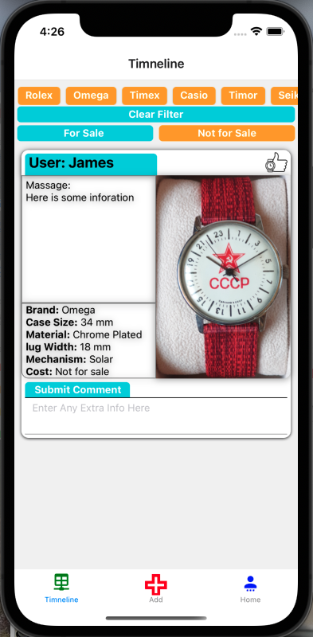

## Project Outline
React Native Typescript with a Firebase Real Time Database 

#### Technologies 
React Native with Typescript 
- Use Navigation: Useing Stack/Tab for navigation, also used route params to pass user id to view the other users profile page 
- Firebase: Using shapshot for real time refreshing and storing the 
- Flatlist: Used to render only a few watches at a time, Also used for some filter buttons 

### Simulation and Compiling:
Exop as a Development SDK to simulate and compile the code into both IOS and Android 
I also used X-code to runt eh IOS simulation compiled by Expo.

### SetUp
Building this project was fairly tough as it took a littel time to figure out which packages work with the tech stach. Typescript seems to be a fairly finiky to set up with React native as there are a few non compatibale parts like buttons being passing in as a component. 

### Images 
 [wireframe](./assets/pictures/readme_2.png) [wireframe](./assets/pictures/readme_3.png)
 [wireframe](./assets/pictures/readme_5.png) [wireframe](./assets/pictures/readme_6.png)

