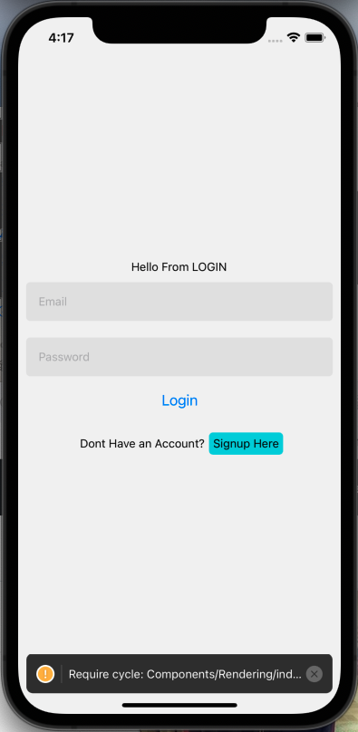

## Project Outline
React Native Typescript with a Firebase Real Time Database 

#### Technologies 
React Native with Typescript 
- Use Navigation: Useing Stack/Tab for navigation, also used route params to pass user id to view the other users profile page 
- Firebase: Using shapshot for real time refreshing and storing the 
- Flatlist: Used to render only a few watches at a time, Also used for some filter buttons 

### Simulation and Compiling:
Exop as a Development SDK to simulate and compile the code into both IOS and Android 
I also used X-code to runt eh IOS simulation compiled by Expo.

### SetUp
Building this project was fairly tough as it took a littel time to figure out which packages work with the tech stach. Typescript seems to be a fairly finiky to set up with React native as there are a few non compatibale parts like buttons being passing in as a component. 

### Starting up

### Images

 
<!-- , [wireframe](./assets/pictures/readme_2.png), [wireframe](./assets/pictures/readme_3.png)
, [wireframe](./assets/pictures/readme_5.png), [wireframe](./assets/pictures/readme_6.png)
 -->

## setting Persistance so user dow not have to sign in each time
node_modules/@firebase/auth/dist/rn/index.js
lines 155, 164, 173 uncomment lines to add persistance.

#### Equations for sorting the data
    const forWatches = async () => {
        const finList: { id: number; name: any; color: string; }[] = []
        let count = 0

        watchNamesList.forEach((item: any) => {
            finList.push({
                "id": count,
                'name': item,
                'color': 'orange'
            })
            count += 1
        })
        console.log(JSON.stringify(finList))
    }
    const forYear = async () => {
        const finList: { id: number; year: number; }[] = []
        let count = 1900
        let setyear = 1900
        if (count < 2022)
            watchNamesList.forEach((item: any) => {
                finList.push({
                    id: count,
                    year: setyear
                })
                count += 1
                setyear += 1
            })
        console.log(JSON.stringify(finList))

    }